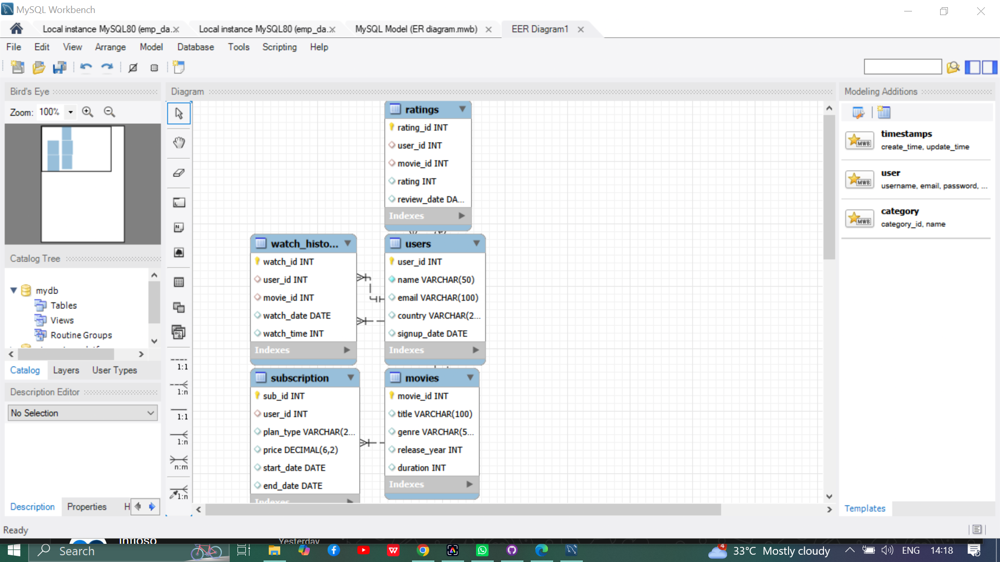

# 🎬 Online Streaming Platform Database (SQL Project)

## 📌 Project Overview

This project is a relational database designed for an **Online Streaming Platform** using **MySQL**. It demonstrates database design concepts including table creation, relationships, constraints, and sample data insertion.

The database simulates how an online streaming service manages users, subscriptions, movies, watch history, and ratings.

---

## 🚀 Features

* User Management
* Subscription Plans
* Movie Catalog
* Watch History Tracking
* Movie Ratings & Reviews
* Relational Database Design
* Sample Dataset for SQL Practice

---

## 🛠️ Technologies Used

* MySQL
* SQL (DDL & DML)

---

## 📂 Database Structure

The project contains the following tables:

| Table         | Description                           |
| ------------- | ------------------------------------- |
| Users         | Stores user information               |
| Subscription  | Stores subscription details for users |
| Movies        | Stores movie information              |
| Watch_History | Tracks movies watched by users        |
| Ratings       | Stores movie ratings given by users   |

---

## 🔗 Database Relationships

* One User → One or More Subscriptions
* One User → Multiple Watch History Records
* One Movie → Multiple Watch Records
* One User → Multiple Ratings
* One Movie → Multiple Ratings

---
## 🗂️ Entity Relationship Diagram



## 📚 SQL Concepts Used

* CREATE DATABASE
* CREATE TABLE
* PRIMARY KEY
* FOREIGN KEY
* UNIQUE Constraint
* CHECK Constraint
* INSERT INTO
* Relational Database Design

---

## 📁 Project Structure

```
Online-Streaming-Platform/
│
├── online_streaming_platform.sql
├── queries.sql          (Recommended)
├── README.md
└── ER_Diagram.png       (Optional)
```

---

## ▶️ How to Run

1. Clone the repository.
2. Open MySQL Workbench (or any MySQL client).
3. Open `online_streaming_platform.sql`.
4. Execute the script.
5. The database and sample data will be created automatically.

---

## 🎯 Learning Objectives

This project demonstrates:

* Database normalization basics
* Designing relational databases
* Managing table relationships
* Applying SQL constraints
* Working with sample datasets
* Building a SQL portfolio project

---


## 👨‍💻 Author

**Riya Singla**
